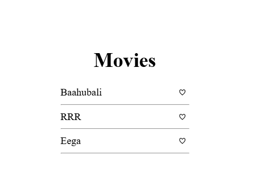
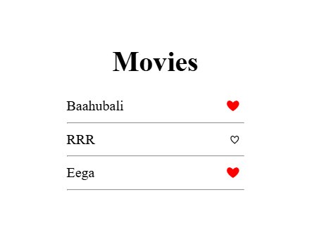

# 🎬 Favorite Icon Toggler
A simple web app that displays a list of movies and allows users to toggle a **favorite** icon (heart) on or off by clicking it.  

## 📌 Features
- Click on a heart icon to mark a movie as favorite.
- Favorite icon turns **red and filled** when selected, and goes back to empty when unselected.
- Simple, clean, and responsive layout.

## 📸 Preview

### First Preview


### Second Preview


## 🛠 Technologies Used
- **HTML5** – Structure of the page.
- **CSS3** – Styling and layout.
- **JavaScript (ES6)** – Toggle functionality for favorite icons.

## 📂 File Structure
.
├── index.html # Main HTML file

├── styles.css # CSS styles

├── script.js # JavaScript for toggling hearts

└── README.md # Project documentation


## 🚀 How to Run
1. Clone this repository or download the ZIP.
   ```bash
   git clone https://github.com/satwika-akula06/favorite-icon-toggler.git
Open index.html in your browser.

Click the heart icon next to a movie to toggle favorite status.

## 💡 How It Works
- Each heart icon is a button with the class .favorite-icon.

- A click event listener toggles:

- The .filled CSS class (which changes the color to red).

- The icon itself between empty heart (♡) and filled heart (❤️).


## 📜 License
- This project is open source and free to use.